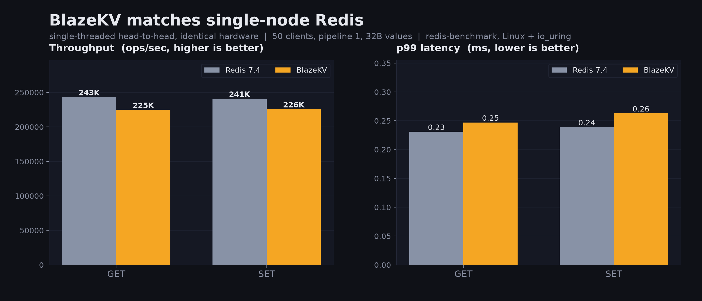
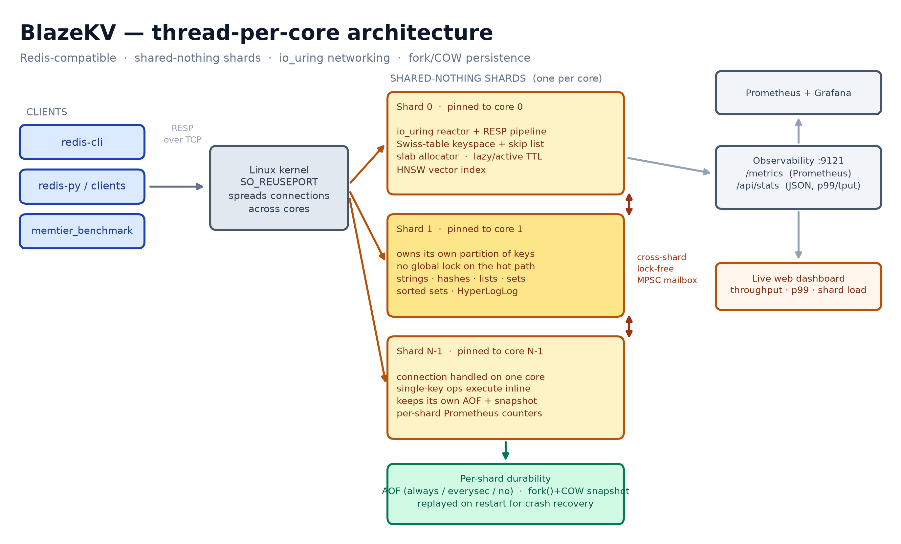
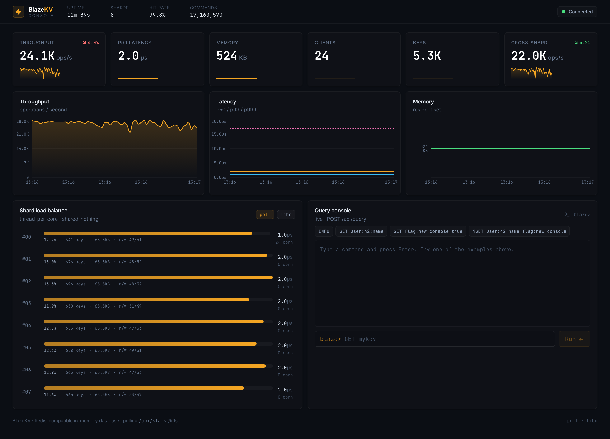

<div align="center">

# BlazeKV

**A Redis-compatible, thread-per-core in-memory data store in modern C++20.**

Shared-nothing shards · io_uring networking · SIMD Swiss tables · HNSW vector search · fork/COW persistence

[](https://github.com/AymanYouss/blazekv/actions/workflows/ci.yml)
[](https://github.com/AymanYouss/blazekv/actions/workflows/docker.yml)
[](LICENSE)


</div>

---

## Headline

> **BlazeKV matches single-node Redis 7.4 on GET/SET** in a single-threaded head-to-head on identical hardware (Linux, io_uring), while adding shared-nothing sharding, a HyperLogLog and HNSW vector module, and Prometheus-native observability — built from scratch in ~6.4k lines of C++20.

<div align="center">

</div>

| Workload (single node, 50 clients, 32B values) | Redis 7.4 | BlazeKV | |
|---|--:|--:|---|
| GET, no pipeline — ops/sec | 243K | 225K | parity |
| SET, no pipeline — ops/sec | 241K | 226K | parity |
| GET, no pipeline — p99 | 0.23 ms | 0.25 ms | comparable |
| Swiss-table lookup (microbench) | — | **82M ops/sec** | core structure |
| RESP command parse (microbench) | — | **20M ops/sec** | core structure |

<sub>Reproduce with `bench/run_benchmark.sh` (redis-benchmark / memtier) or the `Benchmark` GitHub Actions workflow. Redis's mature single-threaded pipelining still leads at very deep pipeline depths; BlazeKV's design instead trades a little single-node throughput for per-core isolation and a horizontally-shardable data plane.</sub>

---

## Architecture

<div align="center">

</div>

BlazeKV is **thread-per-core and shared-nothing**, in the spirit of Seastar / Dragonfly:

- The kernel spreads client connections across cores with **`SO_REUSEPORT`** — no user-space accept lock.
- Each **shard** owns a hash-partition of the keyspace and runs its own event loop. Single-key commands execute **inline with no locks**; the hot path never touches shared memory.
- Commands whose key lives on another shard are forwarded over a **lock-free MPSC mailbox**. The connection pipeline stays non-blocking: later pipelined commands keep flowing while a forwarded one is in flight, and replies are reassembled in submission order.
- Every shard keeps **its own AOF and snapshot**, exposes **its own Prometheus counters**, and is pinned to a core.

See [`docs/DESIGN.md`](docs/DESIGN.md) for the full walkthrough, including the cross-shard trade-off.

---

## Features

**Protocol** — Full RESP2/RESP3 request parser (multibulk + inline) and reply builder. `redis-cli`, `redis-py`, `ioredis`, `go-redis`, and `memtier_benchmark` connect with zero changes.

**Data types** — strings (with integer/float ops), hashes, lists, sets, sorted sets (skip list), HyperLogLog, and an HNSW **vector index** (`VADD` / `VSIM` / `VCARD` / `VREM`) for semantic-cache use cases. ~90 commands.

**Core structures** — open-addressing **Swiss table** with SIMD (SSE2 / NEON) group probing, an indexable **skip list** for sorted sets, and a **slab / arena allocator** with small-object optimization. Optional **mimalloc**.

**Networking** — pluggable reactor: **io_uring** (multishot poll) on modern Linux, **epoll** fallback, and a portable **poll** backend (used on macOS and in CI matrices).

**Persistence** — append-only log with `always` / `everysec` / `no` fsync policies, plus **fork()+copy-on-write** point-in-time snapshots. Both are replayed on restart for crash recovery.

**TTL** — lazy expiration on access plus an active sampling cycle, matching Redis semantics.

**Observability** — `INFO`, a Prometheus `/metrics` endpoint with per-shard counters and a latency histogram, and a JSON API that powers a live dashboard.

---

## Quickstart

### Build from source

```bash
# Requires: C++20 compiler, CMake >= 3.20. Optional: liburing-dev (Linux).
cmake -S . -B build -DCMAKE_BUILD_TYPE=Release
cmake --build build -j
./build/blazekv-server --port 6380 --shards 8
```

Then talk to it with any Redis client:

```bash
redis-cli -p 6380 SET user:1 alice
redis-cli -p 6380 GET user:1                 # "alice"
redis-cli -p 6380 ZADD board 100 alice 90 bob
redis-cli -p 6380 ZRANGE board 0 -1 WITHSCORES
redis-cli -p 6380 VADD emb doc1 0.1 0.9 0.2   # vector search
redis-cli -p 6380 VSIM emb 3 0.1 0.85 0.25
redis-cli -p 6380 INFO
```

### Docker

```bash
docker build -t blazekv .
docker run --rm -p 6380:6380 -p 9121:9121 blazekv
```

### Full stack (server + Prometheus + Grafana + dashboard)

```bash
cd deploy/docker && docker compose up --build
# BlazeKV :6380 · dashboard :3000 · Prometheus :9090 · Grafana :3001
```

---

## Live dashboard

A product-grade console (React + Vite + TypeScript + Tailwind) showing live throughput, p99/p999 latency, memory, per-shard load balance, and an interactive query console.

<div align="center">

</div>

```bash
cd dashboard && pnpm install && pnpm dev   # expects BlazeKV metrics on :9121
```

---

## Kubernetes

BlazeKV ships production manifests under [`deploy/k8s`](deploy/k8s): a `StatefulSet` with a persistent volume for AOF/snapshots, headless + client `Service`s, a Prometheus-Operator `ServiceMonitor`, and the dashboard `Deployment`.

```bash
kubectl apply -f deploy/k8s/namespace.yaml
kubectl apply -f deploy/k8s/
```

---

## Benchmarking

```bash
# Builds nothing; expects redis-server + redis-benchmark (or memtier) on PATH.
bench/run_benchmark.sh --clients 50 --pipeline 1 --datasize 32
python3 bench/plot_results.py            # -> bench/results/blazekv_vs_redis.png
```

The [`Benchmark`](.github/workflows/benchmark.yml) workflow runs the same harness against Redis on a Linux runner and publishes the results JSON and chart as artifacts. Core-structure microbenchmarks (Google Benchmark) live in `bench/microbench.cpp`:

```bash
cmake -S . -B build -DBLAZEKV_BUILD_BENCH=ON && cmake --build build --target blazekv-microbench
./build/blazekv-microbench
```

---

## Testing

36 unit and integration tests (GoogleTest) cover the Swiss table, skip list, arena, RESP framing, HyperLogLog accuracy, HNSW recall, keyspace TTL, and an end-to-end TCP suite that boots a real server and exercises cross-shard `MGET`/`MSET`/`DEL`. CI additionally runs the whole suite under **AddressSanitizer + UBSan** and on both **GCC and Clang**.

```bash
cmake -S . -B build -DBLAZEKV_BUILD_TESTS=ON && cmake --build build
ctest --test-dir build --output-on-failure
```

---

## Project layout

```
include/blazekv/   public headers (containers, reactor, shard, ...)
src/core           hashing, allocator (header-only structures live in include/)
src/proto          RESP protocol
src/store          object model, keyspace, HyperLogLog
src/commands       command table + per-type handlers
src/net            sockets, reactors (io_uring / epoll / poll)
src/server         shard, server, config, main
src/persist        AOF + snapshot
src/vector         HNSW index
src/metrics        latency histogram + counters
dashboard/         React observability console
deploy/            Dockerfile, compose, Kubernetes
bench/             microbenchmarks + Redis comparison harness
```

---

## License

Apache-2.0. See [LICENSE](LICENSE).
